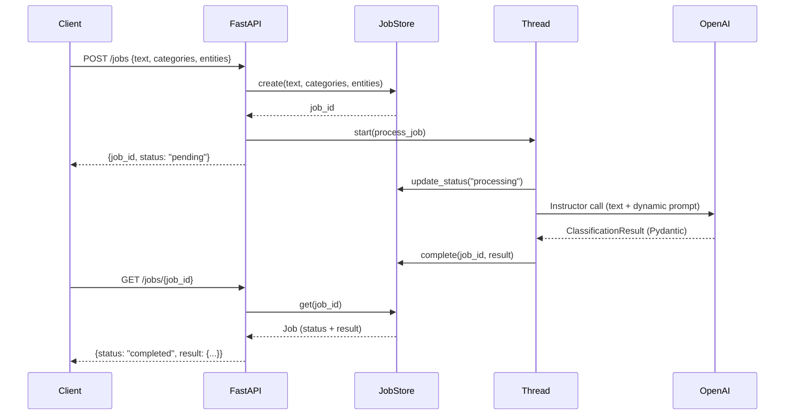
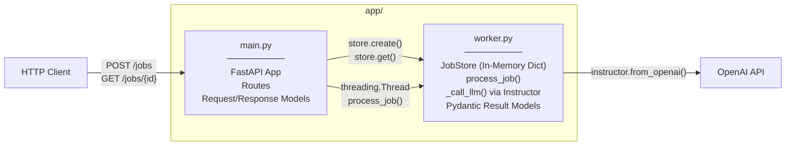
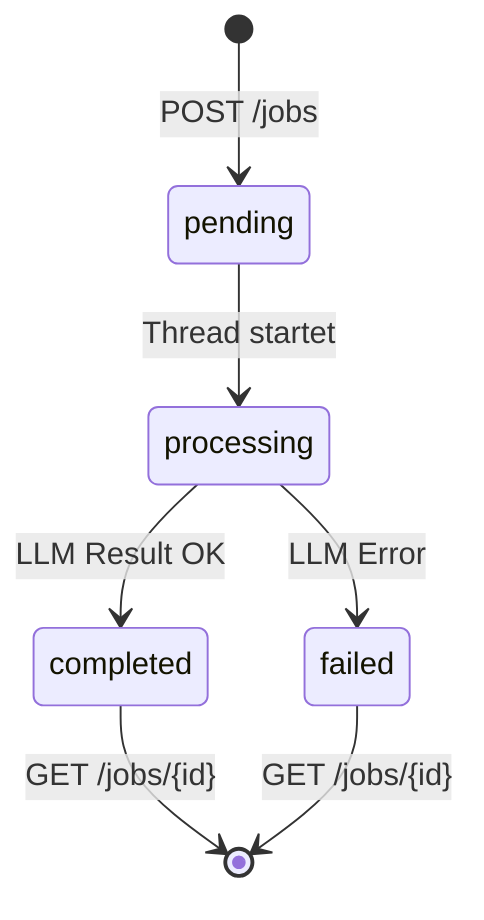

# Architecture - Text Classifier & Entity Extractor

## Request Flow



## Component Overview



## Job Lifecycle



## Projektstruktur

```
agenttemplate/
├── app/
│   ├── main.py        # FastAPI App, Routes, Request/Response Models
│   └── worker.py      # JobStore, LLM Processing, Result Models
├── tests/
│   ├── test_main.py   # API Endpoint Tests
│   └── test_worker.py # JobStore + Processing Tests
├── docs/
│   ├── architecture.md       # ← Du bist hier
│   └── plans/
│       ├── ...-design.md     # Design Doc
│       └── ...-plan.md       # Implementation Plan
├── pyproject.toml
├── .env.example
└── .env                      # (gitignored) OPENAI_API_KEY
```
